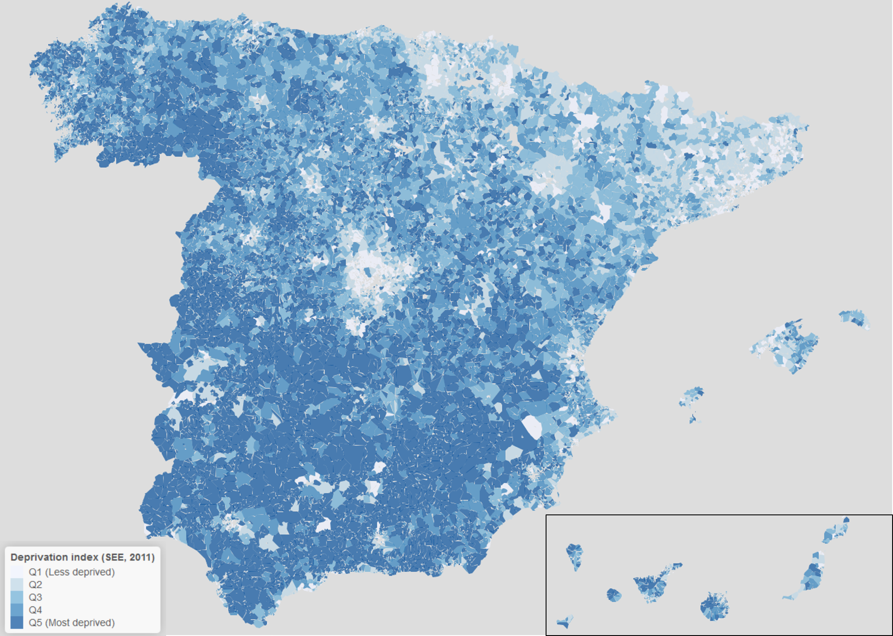

# Deprivation maps in Spain (Mapas de privación en España)

### Script en R para generar un mapa interactivo de privación en España, a nivel de sección censal.

Las **fuentes de información** son:

- INE: Cartografía digitalizada del censo de 2011 http://ine.es/censos2011_datos/cen11_datos_resultados.htm

- SEE: Grupo de Trabajo sobre determinantes sociales de la salud https://www.seepidemiologia.es/gruposdetrabajo.php?contenido=gruposdetrabajosub6